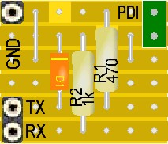
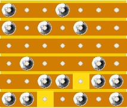

[](https://github.com/0x007e/updi) [](https://www.gnu.org/licenses/gpl-3.0)

# `UPDI` - Adapter

The `UPDI` is an adapter to program the new 0/1/2-Series of Microchip `ATtiny` and `ATmega` with an FT232 USB/UART bridge and `avr-dude`. `TX` line is for transmission from `0/1/2-Series UPDI` pin to UART and `RX` line is for transmission to the `0/1/2-Series UPDI` pin. The USB/UART bridge pins have to be checked bevor connection. Otherwise the programming over UPDI does not work.

| Top                           | Bottom                              |
|:-----------------------------:|:-----------------------------------:|
|  |  |

## Command

``` bash
#                                              !PORT
avrdude.exe -c serialupdi -p t1606 -b 57600 -P COM? -U flash:w:"firmware.hex":a -U eeprom:w:"firmware.eep":a -v
```

> `AVR-Dude` can be downloades [here](https://github.com/avrdudes/avrdude/releases)

## PCB-Version

> A PCB version can be downloades from [Silmors Page](http://silmor.de/tronic.updi.php)

---

R. GAECHTER
